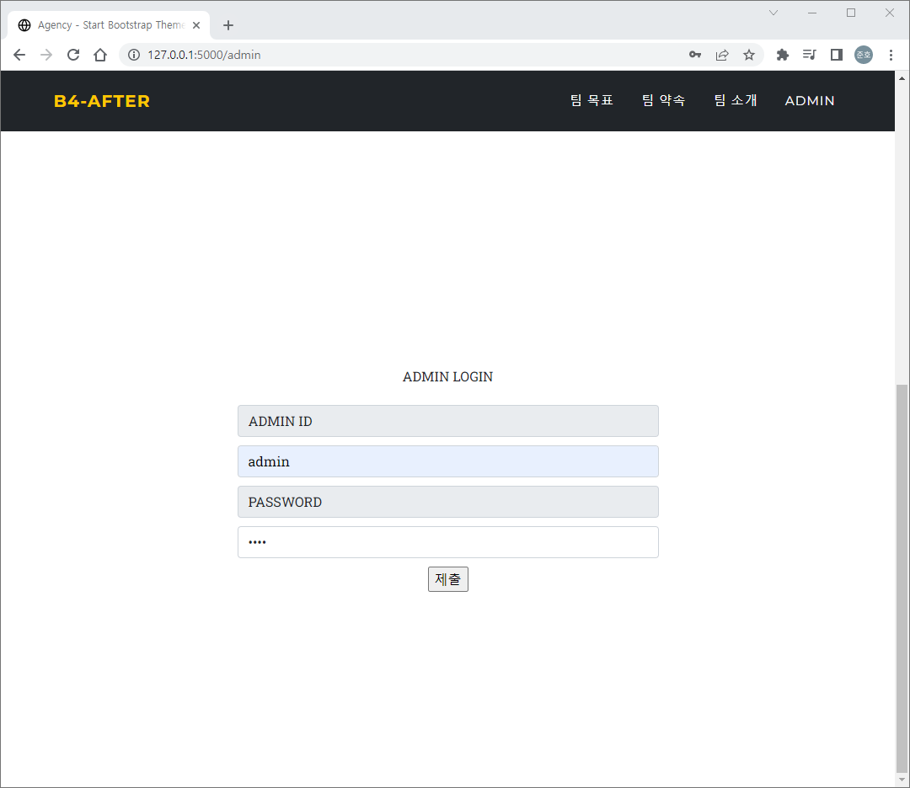

# 2022.08.30 내일배움캠프 2일차

Created: 2022년 8월 30일 오후 8:22
Last Edited Time: 2022년 8월 30일 오후 8:56

# 사전 미니프로젝트 작성 2일차

- POST 요청시 return jsonify() 을 계속 반환한다.
  
  

  ```python
  @app.route('/admin', methods=['POST'])
  def loginAdmin():
      ...
      if user is not None:
  		...
  		...
          return jsonify({'result': 'success', 'token': token})
      else:
          return jsonify({'result': 'fail', 'msg': 'check id or pw'})
  ```

  ```html
  <form action="" method="POST">
    <div class="admin-wrap">
      ... ...
      <input class="button" type="submit" onclick="getcookie()" />
    </div>
  </form>
  ```

  - 원인
    POST 요청시 form에서 한번 보내고 input→ submit에서 한번 총 두번 POST 요청하기 때문에 오류가 난 것이라 생각한다(B4\_김경민님 도움)
  - 해결
    form 태크 주석처리후 실행 결과 문제 없이 잘 작동한다

    ```html
    <!-- <form action="" method="POST"> -->
    <div class="admin-wrap">
      ... ...
      <input class="button" type="submit" onclick="getcookie()" />
    </div>
    <!-- </form> -->
    ```

    

    

    
