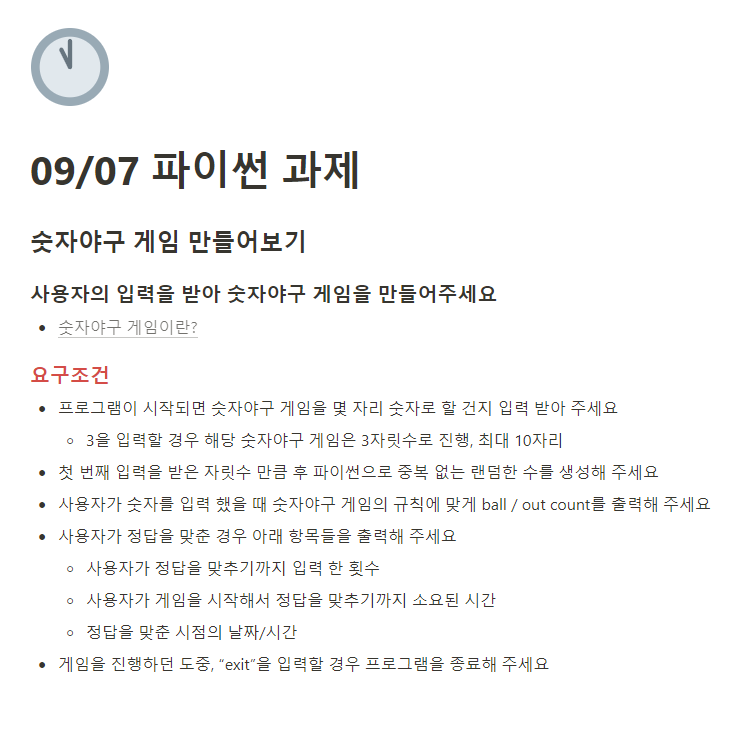

# 2022.09.07 내일배움캠프 10일차

Created: 2022년 9월 7일 오전 9:14
Last Edited Time: 2022년 9월 7일 오후 9:50

## 💡 과제

- 오늘 배운 random, time, datatime 모듈 등을 이용하여 코드 작성
- 과제를 풀긴하였으나 풀기까지 시간이 너무 오래 걸렸고 코드도 지저분하다
- 팀원들과 코드 리뷰 진행 → 부족한 점 개선 예정 ( 정답과 일치하는 부분 찾는 코드)

### 숫자 야구게임 만들기

- 요구조건
  
- 작성 코드

```python
import random
import time
from datetime import datetime, timedelta

def baseball_game(num):
    start_time = time.time()  # 게임 시작 시간
    count = 0  # 게임 진행 횟수(정답까지 걸린 횟수)
    temp_data = set()  # 랜덤한 숫자n개를 받아오기전의 임시 저장소
    qst = [] # 풀어야 하는 게임 문제
    while (len(temp_data) < num):
        temp_data.add(str(random.randint(1, 9)))
    qst = list(temp_data)
    random.shuffle(qst)

    # print(f'qst : {qst}')
    ans = [] # 제출한 게임 문제답
    while (('exit' in ans) != True):
        ans = list(input().split())
        if ('exit' in ans) == True:
            print('프로그램을 종료합니다')
            continue
        elif len(ans) > num:
            print('입력 범위를 초과하였습니다')
            continue
        elif len(ans) < num:
            print('입력수 보다 적게 입력하였습니다.')
            continue

        count += 1
        # print(f'qst : {qst}')
        # print(f'ans : {ans}')
        # 정답일 경우
        if qst == ans:
            print('스트라이크')
            print(f"정답까지 진행한 횟수 : {count}")
            end_time = -(start_time - time.time())
            end_day = datetime.strftime(datetime.now(), "%Y년%m월%d일 %H시%M분")

            print(f'정답을 맞추기까지 소요된 시간: {end_time:.3f}초')
            print(f'정답을 맞춘 날짜/시간: {end_day}')
            break
        else:
            strike = 0
            ball = 0
            for i, _ in enumerate(qst):
                if qst[i] == ans[i]:
                    strike += 1

            # print(len(set(qst) - set(ans)))
            # 정답과 답안지가 정확하게 일치 하지 않지만 숫자가 모두 일치하는 경우
            if len(set(qst) - set(ans)) == 0:
                ball = len(set(qst)) - strike
            # 정답과 답안지의 숫자가 어느 하나라도 같은 경우
            elif len(set(qst) - set(ans)) != len(qst):
                ball = len(set(qst) & set(ans)) - strike
            # 정답과 답안지의 숫자가 모두 불일치 하는경우
            else:
                print(f'아웃')
            print(f'{strike}strike / {ball}ball')

def main():
    exit = False
    while (not exit):
        try:
            print('숫자를 입력하세요: ', end=" ")
            num = input()
            num = int(num)
            if int(num):
                if num > 10:
                    print("최대 10까지 입력 가능합니다")
                else:
                    baseball_game(num)
                    exit = True
                    break
        except:
            if num == 'exit':
                print('프로그램을 종료합니다')
                break
            else:
                print('잘못 입력하셨습니다. 숫자를 입력하세요')

main()

# baseball_game(int(input()))
```

---

## 💡 파이썬 강의

### eval()

- 들어온 입력값을 바로 실행
  ```python
  # 한줄 계산기
  print(eval(input()))
  """
  2 + 3
  5
  """
  ```
- 단점 보안에 취약하다.

  ```python
  # ex)

  import os

  print(eval(input()))
  """
  os.popen('mspaint)
  윈도우 그림판이 실행된다
  """
  ```

- 사용을 하지 않는 것을 권장

### for문 변수 2개 사용가능

#### enumerate()

```python
# enumerate(list) 리스트의 요소를 셀 때 사용할 수 있다.

members = ['lee', 'kim', 'park']
for i, member in enumerate(members):
    print(i, member)
"""
0 lee
1 kim
2 park
"""
```

#### 길이가 같은 리스트

- enumerate() 를 활용 하여 길이가 같은 리스트를 같이 사용할 수있다.
- 길이가 다르면 오류 발생

  ```python
  list_num = [1, 2, 3, 4]
  list_first_name = ['철수', '영희', '영구', '찬수']
  list_last_name = ['김', '이', '박', '최']

  for i, num in enumerate(list_num):
      print(f'{num}번 {list_last_name[i]+list_first_name[i]}')
  ```

- 리스트 안에 딕셔너리 개수만큼 변수 지정

  ```python
  products = {
  	'key1':'value1',
  	'key2':'value2',
  	'key3':'value3',
  }

  # products 딕셔너리의 key 값 사용
  # products.values() 딕셔너리의 value 값 사용
  # products.items() 딕셔너리의 key, value 모두 사용

  for i in products:
  	print(i)
  """
  key1
  key2
  key3
  """

  for i in products.values():
  	print(i)
  """
  value1
  value2
  value3
  """

  for i in products.items():
  	print(i)
  """
  ('key1', 'value1')
  ('key2', 'value2')
  ('key3', 'value3')
  """

  for i, k in products.items():
  	print(i, k)
  """
  key1 value1
  key2 value2
  key3 value3
  """

  # 리스트 안에 딕셔너리 개수만큼 변수 지정
  products = [
      {'key1': 'value1',
       'key2': 'value2',
       'key3': 'value3',
       },
      {'key5': 'value4',
       'key6': 'value5',
       'key7': 'value6',
       },
      {'key8': 'value7',
       'key9': 'value8',
       'key10': 'value9',
       },
  ]

  for i, k, d in products:
      print(f'i:{i}, k:{k}, d:{d}')
  ```

#### range()

```python
# range (시작 번호, 끝 번호, 건너뛸 개수)
for i in range(1, 10, 2)
```

#### break, continue 차이

```python
# 아무런 동작도 아지 않고 다음으로 넘어감
"""
5번 실행되는 반복문이 있다 가정
3번째에서 continue를 만나면
continue 아래 실행 코드를 건너뛰고
4번째 반복문 처음으로 돌아간다
"""
continue
# 반복문 중지
break
```

#### join

- .join 앞에 '원하는 값' 입력하면 된다.

  ```python
  string_list = ['1', '2', '3']

  string = '+' .join(string_list)
  print(string)
  """
  1+2+3
  """
  string = '.' .join(string_list)
  print(string)
  """
  1.2.3
  """
  ```

#### replace()

- 엑셀에서 ctrl+f 에서 값 변경하는거랑 같은 기능이라 생각하면 된다
- .replace('before', ‘after’) → before 바꾸고 싶은 값 입력, after에 바꿀 값 입력

```python
string = 'hello wolrd pyhton'
string = string.replace(' ', '/')
"""
hello/world/python
"""
```

#### pprint()

- 코드 이쁘게 정렬해서 프린트하는 기능

  ```python
  from pprint import pprint

  pprint()
  ```

#### random

```python
import random

# 리스트 랜덤으로 섞기
numbers = [1,2,3,4,5]
random.shuffle(numbers)

# 무작위 번호 생성
"""
randint()와 randerange()의 차이점
마지막 인덱스 숫자를 포함하는지 아닌지만 다르다
"""
random.randerange(1, 10)
random.randint(1, 10)
"""
randerange는 10을 포함하지 않는다 (9까지)
randint은 10을 포함한다
"""

```

#### 공백과 탭문자

- 코드 복사 붙여넣기 할 때 공백과 탭문자가 섞여있으면 코드 실행 오류 발생
- 컨벤션은 공백 4칸이다
- 탭문자만 쓰거나 공백 4칸을 쓰거나 둘중 한가지만 사용해야 오류가 발생하지 않는다

```python
# 아래 코드는 들여쓰기가 차이가 있어보이지만 코드 편집기에서 보면 차이가 없다
for i in range(1)
	print(i) # tab
    print(i) # 공백
"""
error
"""
```

#### \_ 사용 ( 사용하지 않는 변수 ex)for문 )

```python
for i in range(0, 3)
	print('hello')
"""
hello
hello
hello
"""

# 위의 for문에서 i를 사용하지 않는다
# 이럴때는 i 대신 _ 를 넣어준다(파이썬 컨벤션)

for _ in range(0,3):
	print('hello')

"""
hello
hello
hello
"""

```

#### time

- time.time() : 현재 시간 기록
- time.sleep(s) : s초 만큼 지연시키기

```python
# 함수의 실행 시간을 측정 등 시간 다룰 때 사용하는 모듈
# 딜레이와 비슷함?

import time

# 현재 시간 저장하기
start_time = time.time()
# 시간 지연시키기 단위 s
time.sleep(1)
# 현재 시간 저장하기
end_time = time.time()

# 끝 코드까지 걸린 시간 end_time - start_time
 print(f'{end_time-start_time:.5f}')
"""
1.01292
"""
```

#### datetime

- n일 전 날짜 구하기

```python
from datetime import datetime, timedelta

# 현재 날짜 및 시간
datetime.now()

# n일 전 날짜 구하기
n = 1
n_day_ago = datetime.now() - timedelta(n)
print(datetime.now())
print(n_day_ago)
"""
2022-09-07 12:57:09.160713
2022-09-06 12:57:09.160713
"""
```

- datetime의 format code
  - [format code document](https://docs.python.org/ko/3/library/datetime.html#strftime-and-strptime-format-codes)
  ```python
  '''
  %y : 두 자리 연도 / 20, 21, 22
  %Y : 네 자리 연도 / 2020, 2021, 2022
  %m : 두 자리 월 / 01, 02 ... 11 ,12
  %d : 두 자리 일 / 01, 02 ...  30, 31
  %I : 12시간제 시간 / 01, 02 ... 12
  %H : 24시간제의 시간 / 00, 01 ... 23
  %M : 두 자리 분 / 00, 01 ... 58, 59
  %S : 두 자리 초 / 00, 01 ... 58, 59
  '''
  ```

#### string ↔ datetime 변환

- format code 활용하기

```python
# string을 datetime 날짜로 변경하기
string_datetime = "22/12/25 13:20"
datetime_ = datetime.strptime(string_datetime, "%y/%m/%d %H:%M")
print(datetime_) # 2022-12-25 13:20:00

# datetime 날짜를 string으로 변환하기
now = datetime.now()
string_datetime = datetime.strftime(now, "%y/%m/%d %H:%M:%S")
print(string_datetime) # 22/09/04 04:04
```

#### 로또 번호 생성하기

```python
# 로또 번호 생성하기
# 1개 이상 생성
import random
from pprint import pprint

def lotto_number_generator(num):
    if num <= 1:
        print('1보다 큰 수를 입력하세요')
        return False
    result = []
    # for문에서 i를 사용하지 않기 때문에 컨벤션에 따라 _ 로 변경
    # for i in range(num):
    for _ in range(num):
        lotto_numbers = set()
        while len(lotto_numbers) < 6:
            lotto_numbers.add(random.randint(1, 45))
        result.append(lotto_numbers)
    pprint(result)
    return True

def main():
    result = False
    while not result:
        result = lotto_number_generator(int(input()))

main()
```
