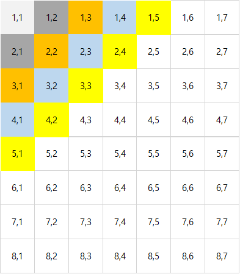

# 2022.09.15 내일배움캠프 18일차

Created: 2022년 9월 15일 오전 9:21
Last Edited Time: 2022년 9월 16일 오전 1:54

## 파이썬 강의

### 함수 힌트

- **변수명: 자료형** 으로 힌트를 줄 수 있다
- 함수 선언 후 함수 안에서 **“””** (””” “””) 입력시 자동완성 기능으로 함수의 관한 설명이 생긴다

```python
def test(num1: int, num2: int) -> int:
    """_summary_

    Args:
        num1 (int): _description_
        num2 (int): _description_

    Returns:
        int: _description_
    """
    return num1 + num2
```

### 함수 인자 기본값 지정

- **인자명 = 기본값**
- 인자당 기본값은 하나만 지정할 수 있다

```python
def test(num1=0, num2=0, option=None):
	print(num1, num2, option)

test()
test(1,2,'test')
"""
0 0 None
1 2 test
"""
```

### args / kwargs

- 받을 인자 개수가 불규칙하거나 많을 때 사용한다
- args는 **\*args** kwargs는 \***\*kwargs** 로 명시
- dict 자료형은 kwargs로 들어간다(키워드)
- args 의 자료형은 튜플, kwargs 의 자료형은 딕셔너리
- 지정한 인수 개수가 넘어가면 자동으로 args 또는 kwargs로 할당된다
- 인자 입력시 딕셔너리는 “key”: “value” 가 아닌 **key='value'** 이다

```python
def main(num1, num2, *args, **kwargs):
    print(f'num1 = {num1}')
    print(f'num2 = {num1}')
    print(f'args = {args}')
    print(f'kwargs = {kwargs}')

main(1, 2, 3, 4, 5, key='value')
"""
num1 = 1
num2 = 1
args = (3, 4, 5)
kwargs = {'key': 'value'}
"""
```

### 패킹과 언패킹

- 언패킹

  - - 을 붙임으로써 리스트라는 속성이 사라진다(\*args)
  - ** 을 붙임으로써 딕셔너리 속성이 사라진다(**kwargs)
  - 언패킹은 끝에 있는 [] 또는 {}만 없앨 수 있다.
  - 리스트 안에 리스트는 언패킹 할 수 없다

  ```python
  def add(num1, num2, num3):
      return num1 + num2 + num3

  a = [1, 2, 3]

  # num1로 a 리스트가 다 넘어가기 때문에 오류 발생
  print(add(a))

  # 언패킹으로 넣으면 정상 실행(단 인자 개수가 맞아야한다)
  print(add(*a))
  ```

  ```python
  def add(*args):
      result = 0
      for i in args:
          result += i
      return result

  a = [1, 2, 3, 4, 5, 6, 7, 8]

  print(add(*a))
  print(add(1, 2, 3, 4, 5, 6, 7, 8))
  """
  36
  36
  """
  ```

### 객채지향

- 객채를 모델링하는 방향으로 코드를 작성하는 것

```python
# isinstance()
# 클래스 내에서 _변수명 은 클래스 내에서만 쓰겠다는 약속

# email 검증 정규표현식으로 (re)

__repr__
__str__
@property
@함수명.setter

```

---

## 백준 문제 풀이

### 1. 1712번:손익분기점

```python
"""
생산 개수 n
고정비용 a
재료비 인건비 b
노트북 가격 c

(a + n*b) / n = c

n = (c-b) / a
"""
a, b, c = list(map(int, input().split()))

if c - b < 0 or c == b:
    result = -1
else:
    result = int(a / (c-b) + 1)

print(result)
```

### 2. 2292번: 벌집

```python
"""
n = 1 + i + 6x
"""
num = int(input())
sell = 1
count = 6
sum = 1

if num != 1:
    while True:
        sum += count
        sell += 1
        if num <= sum:
            break
        count += 6
print(sell)
```

### 3. 10575번: 큰 수 A+B

```python
num1, num2 = list(map(int, input().split()))

print(num1 + num2)
```

### 4. 2869번: 달팽이는 올라가고 싶다

1. 첫 코드

   - 처음 달팽이가 낮에 올라가는 길이와 밤에 미끌어지는 길이를 빼서 날짜를 구하는 코드 작성
   - 달팽이가 정상에 자기 전에 정상에 올라갈 수있다는 것을 생각하지 않았다
   - 틀린 닶

   ```python
   a, b, v = list(map(int, input().split()))
   while True:
       if v < 0:
           break
       if v >= a:
           print(v)
           v -= (a-b)
           day += 1
       else:
           v -= a
   print(day)

   while True:
       day += 1
       if (a-b) * day >= (v-a):
           print(day+1)
           break
   ```

1. 두번째 코드

   - 달팽이가 자기 전에 올라갈 수 있는 길이가 앞으로 남은 거리보다 짧은지 확인

   ```python
   a, b, v = list(map(int, input().split()))
   day = (v - a) // (a - b) + 1
   m = ((v - a) / (a - b)) - (v - a) // (a - b)
   if m < 1 and m != 0:
       day += 1
   print(day)
   ```

### 5. 1193번: 분수찾기

- 행과 열의 합이 같다(색깔 표시) → i+j = n
- x = n(n+1) /2
  - n = 홀수 일 경우 숫자 오름차순 시작
    n = 짝수 일 경우 숫자 내림차순 시작
- 알고리즘을 구현하는데 시간이 오래 걸렸다



```python
n = 0
number = int(input())
max = 0
result = []

while max < number:
    n += 1
    max += n
    if max >= number:
        n -= 1
        max = max - n-1
        break

rows = [x for x in range(1, n+2, 1)]
cols = [y for y in reversed(rows)]

if number == 1:
    print(f'1/1')
else:
    for i, row in enumerate(rows):
        if n % 2 != 0:
            result = [row, cols[i]]
        else:
            result = [cols[i], row]
        max += 1
        if max == number:
            print(f'{result[0]}/{result[1]}')
            break
```
